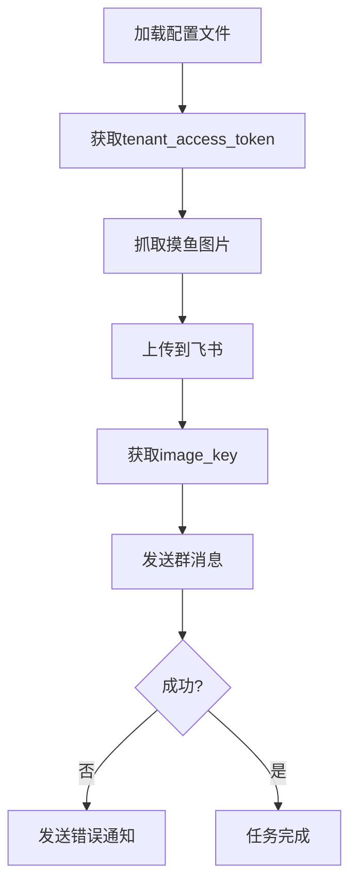

# 摸鱼日报机器人

这是一个用于自动获取并发送摸鱼日报到飞书群的机器人程序。

摸鱼日报：<https://dayu.qqsuu.cn/moyuribao/apis.php>

## 流程图



## 设置步骤

1. 复制示例配置文件并填入你的凭据:

   ```bash
   cp config.example.json config.json
   ```

2. 编辑 `config.example.json` 文件，填入你的:

   - 飞书机器人Webhook URL (webhook_url)
   - 飞书应用ID (app_id)
   - 飞书应用密钥 (app_secret)

   修改后，将文件重命名为 `config.json`并保存。

   ```json
   {
      "webhook_url": "https://open.feishu.cn/open-apis/bot/v2/hook/your-webhook-id",
      "app_id": "your-app-id",
      "app_secret": "your-app-secret",
      "tenant_token_url": "https://open.feishu.cn/open-apis/auth/v3/tenant_access_token/internal",
      "upload_url": "https://open.feishu.cn/open-apis/im/v1/images",
      "api_url": "https://dayu.qqsuu.cn/moyuribao/apis.php"
   }
   ```

3. 运行程序:

   ```bash
   python dailyReport.py
   ```

### 设置定时任务

1. 确保shell脚本有执行权限

   ```bash
   chmod +x run_daily_report.sh
   ```

2. 编辑crontab

   ```bash
   crontab -e
   ```

3. 添加定时任务（例如每天早上9点运行）

   ```
   0 9 * * * /bin/bash /完整路径/moyu_dailyReport/run_daily_report.sh
   ```

## 配置说明

在`config.json`中需要配置以下字段:

- `webhook_url`: 飞书群聊的webhook URL
- `tenant_token_url`: 获取tenant_token的URL
- `app_id`: 飞书应用的App ID
- `app_secret`: 飞书应用的App Secret
- `upload_url`: 飞书图片上传API地址
- `api_url`: 摸鱼日报API地址
