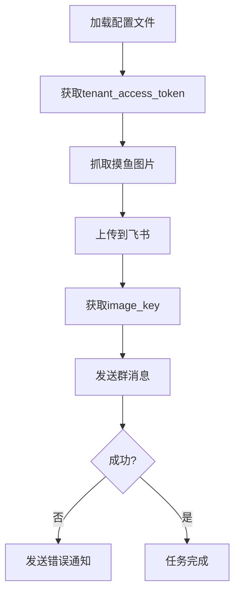

# 摸鱼日报机器人

这是一个用于自动获取并发送摸鱼日报到飞书群的机器人程序。
摸鱼日报：<https://dayu.qqsuu.cn/moyuribao/apis.php>

## 流程图



## 设置步骤

1. 复制示例配置文件并填入你的凭据:
   ```bash
   cp config.example.json config.json
   ```

2. 编辑 `config.json` 文件，填入你的:
   - 飞书机器人Webhook URL
   - 飞书应用ID (app_id)
   - 飞书应用密钥 (app_secret)
```json
{
    "webhook_url": "https://open.feishu.cn/open-apis/bot/v2/hook/your-webhook-id",
    "app_id": "your-app-id",
    "app_secret": "your-app-secret",
    "tenant_token_url": "https://open.feishu.cn/open-apis/auth/v3/tenant_access_token/internal",
    "upload_url": "https://open.feishu.cn/open-apis/im/v1/images",
    "api_url": "https://dayu.qqsuu.cn/moyuribao/apis.php"
}
```


3. 运行程序:
   ```bash
   python dailyReport.py
   ```

## 安全注意事项

- `config.json` 文件已被添加到 `.gitignore` 中，请确保不要将其提交到版本控制系统
- 定期更新你的应用密钥和机器人Webhook URL

## 定时执行

可以使用crontab设置定时任务，每天自动发送摸鱼日报，例如:

```bash
# 每天上午9:00发送
0 9 * * * cd /path/to/moyu_dailyReport && python dailyReport.py
```
